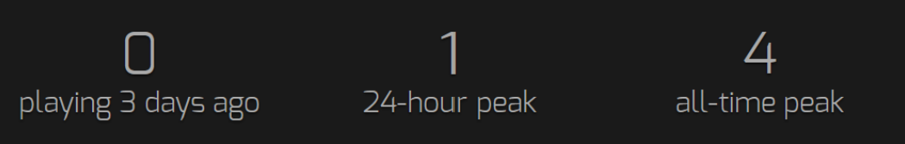
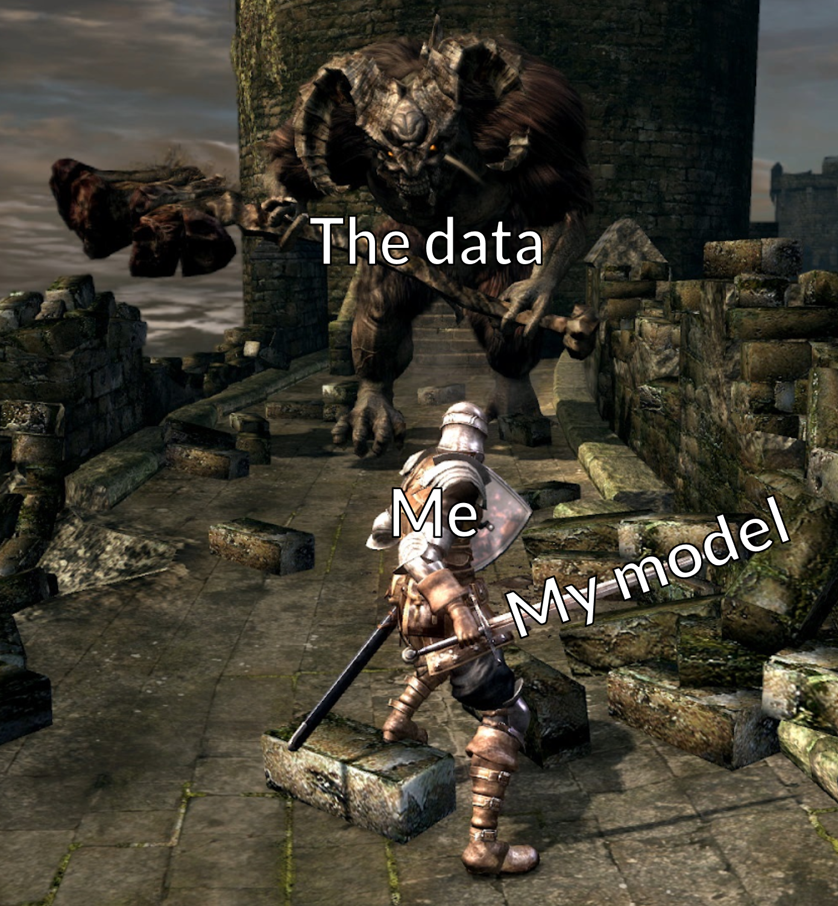

# "There just aren't enough people playing my wizard simulator" - An analysis of Steam Sales and their impact on player numbers

### **Executive Summary**

The goal was the create a model that could accurately predict how many extra players a game gets when it is discounted on Steam. This would hopefully provide insights into how developers could make the most out of discounting their games, and could be especially valuable to small, independent developers who don't have access to their own analytics teams.

In order to maximise number of datapoints, the analysis was based around the Steam Summer Sale 2019, a large sale event running from 25th June to 9th July where approximately 3/4s of the games for sale were discounted. The variable to be predicted was the difference in average player numbers between the month before and the month after the sale (June to July).

Information on which games were discounted, and by how much, was scraped from [IsThereAnyDeal.com](https://www.isthereanydeal.com), and player number information was scraped from [SteamCharts.com](https://www.steamcharts.com). Information about the games themselves was taken from the Steam Store API (originally planned to be done by myself, before finding it already done on Kaggle).

Ultimately, by far the biggest predictor of player numbers (whether absolute or change) turned out to be past player numbers, and using these values alone is already a fairly successful prediction for future player numbers. By removing some of the most popular games from the dataset (still keeping over 99% of the sample), a Random Forest model was created that, although not especially powerful, was relatively stable.

Based on the model discount amount has only a small impact on the change in player numbers after a sale. Considering the current low accuracy though, this cannot be taken as a definitive conclusion. Some further avenues of investigation and/or ways in which the data could be collected differently were also identified, which may help make a more valuable model in the future.

---

Below are links to each stage of the project, with a summary writeup and full jupyter notebooks including all code used.

[Data Collection](/notebooks/data_collection)

[Data Cleaning and EDA](/notebooks/data_cleaning_and_eda)

[Modelling](/notebooks/modelling)

[Conclusions and Next Steps](/notebooks/conclusions)

